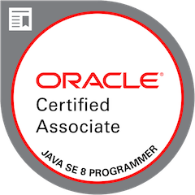

# My academic life :white_check_mark:

Reserved repository to list a little of my `academic life.`:heart_eyes:

## Index :pushpin:
- [Academic Education](#education)
- [Certification](#certification)
- [Languages](#languages)
- [Courses](#courses)

## Academic Education  :mortar_board:

- `Bachelor's degree of Information Systems` - University of Mogi das Cruzes _(Brazil) [website](http://www.umc.br/)._ 2015-2018 (4 years). :paperclip: [here](certificates/university-bachelor-degree.png)
- `Information Technology` - Cetés College _(Brazil) [website](https://www.cetes.com.br/)._ 2013-2014 (1 year and half). :paperclip: [here](certificates/information-technology.png)

## Certification  :star:

- Oracle Certified Associate, Java SE 8 Programmer _(OCAJP8)_. `Oracle`. May/2018. :paperclip: [here](https://www.youracclaim.com/badges/c730d0f0-48c6-4128-8b03-d7e5e381a250/linked_in_profile)

## Languages  :round_pushpin:

- **Portuguese:** Native speaker, I am Brazilian.:brazil:
- **English:** Full professional proficiency.:gb:
- **Spanish:** Elementary proficiency.:es:

## Courses  :pencil2:

Below is a list of the courses I completed. There are currently `53` courses with a total of `563 hours.`

#### Linux

- Linux I: Getting to know and using the terminal. _School: [Alura](https://www.alura.com.br/)._ _Duration: 4h._ :paperclip: [here](https://cursos.alura.com.br/certificate/72e5b5c3-7ee4-4dee-94d2-84481e5b73b0)
- Linux II: Programs, processes and packages. _School: [Alura](https://www.alura.com.br/)._ _Duration: 8h._ :paperclip: [here](https://cursos.alura.com.br/certificate/db4f0d5e-bbc7-48f8-9c1b-cd0778771d27)
- Shell Scripting I: Starting your task automation scripts. _School: [Alura](https://www.alura.com.br/)._ _Duration: 8h._ :paperclip: [here](https://cursos.alura.com.br/certificate/6e30a662-c074-4269-81f9-2871b3b8cf0d)
- Shell Scripting II: Monitoring, scheduling tasks and backup. _School: [Alura](https://www.alura.com.br/)._ _Duration: 8h._ :paperclip: [here](https://cursos.alura.com.br/certificate/940db26e-0158-455d-8244-e1847a1447d0)
- Regular expressions: Capturing text in a magical way. _School: [Alura](https://www.alura.com.br/)._ _Duration: 12h._ :paperclip: [here](https://cursos.alura.com.br/certificate/4b020b10-34e3-4dca-85ab-941e212e936a)

#### Git

- Git and Github: Control and share your code. _School: [Alura](https://www.alura.com.br/)._ _Duration: 6h._ :paperclip: [here](https://cursos.alura.com.br/certificate/22f1457d-97b6-4106-81dc-a72e2fc63355)
- Git and Github: Branching Strategies, Conflicts and Pull Requests. _School: [Alura](https://www.alura.com.br/)._ _Duration: 8h._ :paperclip: [here](https://cursos.alura.com.br/certificate/0d3ee304-c98e-44f0-af36-51da7fc8fc8c)

#### Algorithms

- Algorithms I: Selection, Insertion and Introduction to Analysis. _School: [Alura](https://www.alura.com.br/)._ _Duration: 12h._ :paperclip: [here](https://cursos.alura.com.br/certificate/d780e68c-0a53-4cc4-a858-7ff718ffb8e7)

#### Java

- Maven: Build from scratch the web. _School: [Alura](https://www.alura.com.br/)._ _Duration: 6h._ :paperclip: [here](https://cursos.alura.com.br/certificate/a39f8714-8924-4b97-a38c-24c147d69bde)
- Java and JPA: Persist your objects with JPA2 and Hibernate. _School: [Alura](https://www.alura.com.br/)._ _Duration: 16h._ :paperclip: [here](https://cursos.alura.com.br/certificate/25612ecf-787e-47f4-9f43-626d791d0896)
- SOLID with Java: Object Orientation with Java. _School: [Alura](https://www.alura.com.br/)._ _Duration: 8h._ :paperclip: [here](https://cursos.alura.com.br/certificate/f7d3026c-1a4c-4498-a0a1-7d45ec17a23f)
- Java 8: Take advantage of new language features. _School: [Alura](https://www.alura.com.br/)._ _Duration: 12h._ :paperclip: [here](https://cursos.alura.com.br/certificate/a0101897-7e19-495c-8f40-c8e84dbff082)
- Design Patterns Java I: Good programming practices. _School: [Alura](https://www.alura.com.br/)._ _Duration: 20h._ :paperclip: [here](https://cursos.alura.com.br/certificate/acb3ee73-1b1b-436f-8b34-1d6c35f46e04)
- Design Patterns Java II: Good programming practices. _School: [Alura](https://www.alura.com.br/)._ _Duration: 16h._ :paperclip: [here](https://cursos.alura.com.br/certificate/3acba130-09a3-4cda-89c7-5806b8920c82)
- Tests: TDD with Java. _School: [Alura](https://www.alura.com.br/)._ _Duration: 12h._ :paperclip: [here](https://cursos.alura.com.br/certificate/61d09c69-4a06-4d15-9945-57e4a115af6b)

#### Spring

- Spring MVC I: Creating web applications. _School: [Alura](https://www.alura.com.br/)._ _Duration: 20h._ :paperclip: [here](https://cursos.alura.com.br/certificate/4277d7d0-70a2-4bfa-85ab-d0f8956fa6fe)
- Spring MVC II: Integration, cache, security and templates. _School: [Alura](https://www.alura.com.br/)._ _Duration: 15h._ :paperclip: [here](https://cursos.alura.com.br/certificate/dec2ba60-83c0-4ff1-9836-8c2b0bc41c85)
- Spring Boot: Agility in Java development with Spring. _School: [Alura](https://www.alura.com.br/)._ _Duration: 10h._ :paperclip: [here](https://cursos.alura.com.br/certificate/b143bbea-d380-4191-8c06-a679afcdaa20)
- Spring Boot I: Build a Rest API. _School: [Alura](https://www.alura.com.br/)._ _Duration: 8h._ :paperclip: [here](https://cursos.alura.com.br/certificate/e926092f-c025-4587-a32c-93198c70ac09)
- Spring Boot II: API Security, Cache and Monitoring. _School: [Alura](https://www.alura.com.br/)._ _Duration: 12h._ :paperclip: [here](https://cursos.alura.com.br/certificate/ec2810d4-fbb2-4342-bbb9-3822b0aa7197)
- Spring Framework 5 and Spring Boot 2. _School: [Udemy](https://www.udemy.com)._ _Duration: 7.5h._ :paperclip: [here](https://www.udemy.com/certificate/UC-O76UDY7X/)

#### Microservice with Spring Boot

- Microservices with Spring Cloud: Registry, Config Server and Distributed Tracing. _School: [Alura](https://www.alura.com.br/)._ _Duration: 8h._ :paperclip: [here](https://cursos.alura.com.br/certificate/cb63a8f3-f712-4936-a165-d41068befbef)
- Moving forward with microservices: Circuit Breaker, Hystrix and API Gateway. _School: [Alura](https://www.alura.com.br/)._ _Duration: 10h._ :paperclip: [here](https://cursos.alura.com.br/certificate/ad65fa31-4cd8-4fcf-8cf6-8085bd713979)

#### JavaScript

- HTTP: Understanding the web behind the scenes. _School: [Alura](https://www.alura.com.br/)._ _Duration: 14h._ :paperclip: [here](https://cursos.alura.com.br/certificate/615446cb-d038-41a1-a2b5-afaad6c836af)
- JavaScript: Programming in the web language. _School: [Alura](https://www.alura.com.br/)._ _Duration: 20h._ :paperclip: [here](https://cursos.alura.com.br/certificate/4ccfaff1-7a36-46d0-8184-c7923847f251)
- Advanced JavaScript I: ES6, object orientation and design patterns. _School: [Alura](https://www.alura.com.br/)._ _Duration: 12h._ :paperclip: [here](https://cursos.alura.com.br/certificate/c7317ef3-1a03-40f9-ab38-d214844c1a45)
- Advanced JavaScript II: ES6, object orientation and design patterns. _School: [Alura](https://www.alura.com.br/)._ _Duration: 12h._ :paperclip: [here](https://cursos.alura.com.br/certificate/b417d094-00d2-4314-9782-1695e8e45806)
- Advanced JavaScript III: ES6, object orientation and design patterns. _School: [Alura](https://www.alura.com.br/)._ _Duration: 12h._ :paperclip: [here](https://cursos.alura.com.br/certificate/376a1934-f341-447f-9e96-2debf9fdaa59)

#### TypeScript

- TypeScript I: Evolving your Javascript. _School: [Alura](https://www.alura.com.br/)._ _Duration: 8h._ :paperclip: [here](https://cursos.alura.com.br/certificate/9e617e65-8812-472a-9c65-235714b82a27)
- TypeScript II: More techniques and best practices. _School: [Alura](https://www.alura.com.br/)._ _Duration: 10h._ :paperclip: [here](https://cursos.alura.com.br/certificate/1dd90902-a678-446c-81c5-df04b34b48bc)

#### AngularJS and Angular 2+

- Angular JS in practice. _School: [Udemy](https://www.udemy.com)._ _Duration: 2h._ :paperclip: [here](https://www.udemy.com/certificate/UC-Z2JI5GSX/)
- AngularJS: create powerful webapps. _School: [Alura](https://www.alura.com.br/)._ _Duration: 16h._ :paperclip: [here](https://cursos.alura.com.br/certificate/acd195bb-0793-4a75-bc0c-ce15fa90c9f1)
- Webpack: Manipulating modules in your webapp. _School: [Alura](https://www.alura.com.br/)._ _Duration: 8h._ :paperclip: [here](https://cursos.alura.com.br/certificate/a4db88ba-d141-4edb-924c-1decca768e70)
- Angular I: Fundamentals. _School: [Alura](https://www.alura.com.br/)._ _Duration: 16h._ :paperclip: [here](https://cursos.alura.com.br/certificate/ddf0760c-33c3-4788-9efb-f2a4c2fc5dde)
- Angular II: Authentication, Forms and lazy loading. _School: [Alura](https://www.alura.com.br/)._ _Duration: 12h._ :paperclip: [here](https://cursos.alura.com.br/certificate/86849599-10a0-43c1-853c-dc37e1402ccb)
- Angular III: upload, build and new components. _School: [Alura](https://www.alura.com.br/)._ _Duration: 12h._ :paperclip: [here](https://cursos.alura.com.br/certificate/f07af293-fbf1-49ef-b9ff-732a737d2b34)
- Angular IV: polishing the project. _School: [Alura](https://www.alura.com.br/)._ _Duration: 10h._ :paperclip: [here](https://cursos.alura.com.br/certificate/4bf50325-685d-4e1f-8cf1-1f7498cbea9d)
- Angular 9 - Essential. _School: [Cod3r](https://www.cod3r.com.br/)._ _Duration: 13h._ :paperclip: [here](https://www.credential.net/972252d2-d27c-48ea-8082-b83e54434bba)

#### Database

- MongoDB: An alternative to traditional relational banks. _School: [Alura](https://www.alura.com.br/)._ _Duration: 6h._ :paperclip: [here](https://cursos.alura.com.br/certificate/677b7a6f-0e76-45f3-b3ec-ae626e0dc2b6)
- Redis I: Storing keys and values. _School: [Alura](https://www.alura.com.br/)._ _Duration: 20h._ :paperclip: [here](https://cursos.alura.com.br/certificate/ec101d3e-b350-4727-a8eb-0a7eeb6ee4b2)
- Redis II: Structures and resources in its NoSQL base. _School: [Alura](https://www.alura.com.br/)._ _Duration: 10h._ :paperclip: [here](https://cursos.alura.com.br/certificate/23f77be5-c46b-4f39-853a-c1d940be5cc5)

#### Message

- RabbitMQ with Spring Boot and Docker. _School: [Udemy](https://www.udemy.com)._ _Duration: 1.5h._ :paperclip: [here](https://www.udemy.com/certificate/UC-65664720-38f9-44b3-817d-052cf8197627/)

#### DevOps

- Docker: Creating headache-free containers. _School: [Alura](https://www.alura.com.br/)._ _Duration: 10h._ :paperclip: [here](https://cursos.alura.com.br/certificate/42c62047-ac84-4ae1-8db5-d66abd097818)
- Continuous Integration: Maturity and productivity in software development. _School: [Alura](https://www.alura.com.br/)._ _Duration: 16h._ :paperclip: [here](https://cursos.alura.com.br/certificate/d1c937c9-db51-47a1-9cfc-06a326c9d99b)
- Jenkins and Docker: Continuous delivery pipeline. _School: [Alura](https://www.alura.com.br/)._ _Duration: 8h._ :paperclip: [here](https://cursos.alura.com.br/certificate/1bd5f7eb-c854-48fd-b1ea-f32c2d04b36c)
- Kubernetes: Introduction to container orchestration. _School: [Alura](https://www.alura.com.br/)._ _Duration: 8h._ :paperclip: [here](https://cursos.alura.com.br/certificate/3519f598-a55c-49e7-8cd6-7875ad2aea59)
- Kubernetes: Orchestration of containers. _School: [Alura](https://www.alura.com.br/)._ _Duration: 10h._ :paperclip: [here](https://cursos.alura.com.br/certificate/3e520682-4471-4e93-bce8-225aabd32b9a)

#### Cloud Computing

- Deploy on Amazon EC2: High availability and scalability of an application. _School: [Alura](https://www.alura.com.br/)._ _Duration: 10h._ :paperclip: [here](https://cursos.alura.com.br/certificate/39a5f8d0-cecc-4770-94dd-8d45a018a03f)
- Amazon Lightsail: Uncomplicating the cloud. _School: [Alura](https://www.alura.com.br/)._ _Duration: 8h._ :paperclip: [here](https://cursos.alura.com.br/certificate/6f9b6867-3d59-4b35-895d-9ac251cb4370)
- Amazon CloudWatch: Complete visibility of cloud applications and services. _School: [Alura](https://www.alura.com.br/)._ _Duration: 6h._ :paperclip: [here](https://cursos.alura.com.br/certificate/b15aab1c-6cf0-4934-9016-97a9ad5c026f)
- Amazon VPC: Provision a private cloud. _School: [Alura](https://www.alura.com.br/)._ _Duration: 6h._ :paperclip: [here](https://cursos.alura.com.br/certificate/9127b6d0-0fe8-471c-9766-b8db5209ee50)
- Amazon ECS: Manage Docker in the AWS Cloud. _School: [Alura](https://www.alura.com.br/)._ _Duration: 8h._ :paperclip: [here](https://cursos.alura.com.br/certificate/9ff7f436-3077-49b8-83b5-0db4946f6875)
- Amazon S3: Manipulate and store objects in the cloud. _School: [Alura](https://www.alura.com.br/)._ _Duration: 12h._ :paperclip: [here](https://cursos.alura.com.br/certificate/1c874f46-df2c-4643-8865-aaf4c49b891b)
